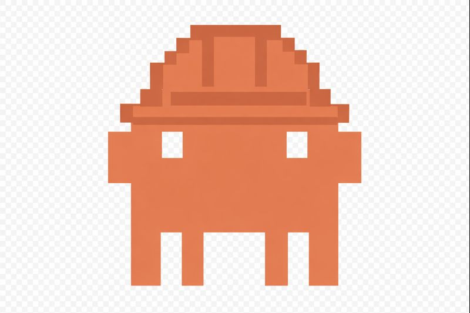

#  Practical Claude

A hands-on presentation covering demos, patterns, and pro tips for getting the most out of [Claude Code](https://claude.ai/code).

## What's Inside

An interactive terminal presentation that walks through the software development lifecycle while building a real CLI tool (`eli5`). Topics covered:

- **Getting Started**: Installation, `/init`, CLAUDE.md
- **Planning**: Plan mode, subagents, Opus vs Sonnet
- **Building**: Hooks, slash commands, skills
- **Shipping**: Permissions, code review, GitHub Actions
- **Scaling**: Parallel Claudes, remote sessions, teleporting
- **Power User**: MCP, verification strategies, notifications

## Requirements

- [Node.js](https://nodejs.org/) 18+ (for Claude Code)
- [Go](https://golang.org/) 1.21+ (for the eli5 demo)
- [slides](https://github.com/maaslalani/slides) (terminal presentation tool)
- An [Anthropic API key](https://console.anthropic.com/)

## Quick Start

```bash
# Install Claude Code
npm install -g @anthropic-ai/claude-code

# Install slides
go install github.com/maaslalani/slides@latest

# Clone this repo
git clone https://github.com/jonasrmichel/practical-claude.git
cd practical-claude

# Run the presentation
slides --theme theme.json presentation.md
```

## Presentation Controls

| Key | Action |
|-----|--------|
| `Space` / `→` / `j` | Next slide |
| `←` / `k` | Previous slide |
| `Ctrl+E` | Execute code block |
| `g` `g` | First slide |
| `G` | Last slide |
| `q` | Quit |

## Running the eli5 Demo

The presentation builds a Go CLI that explains topics simply:

```bash
cd eli5
go mod tidy
go build -o eli5 .
export ANTHROPIC_API_KEY=your-key-here
./eli5 "quantum computing"
```

## License

MIT
